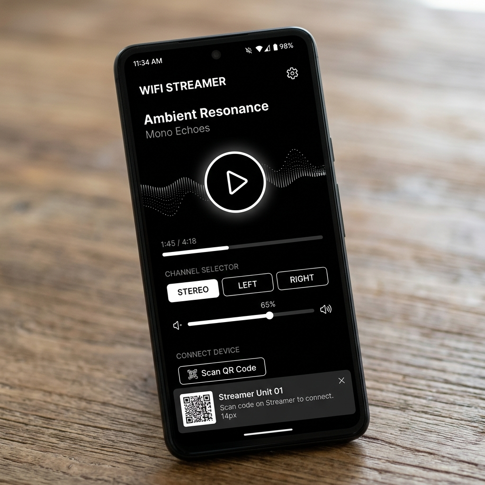

# 🎧 Wi-Fi Audio Streamer

<p align="center">
  
  
  
  
  
</p>

> **Turn any smartphone into a wireless Bluetooth-like speaker for your PC over Wi-Fi.**  
> Stream system sound with **ultra-low latency (<100ms)** without installing any apps on your phones—just scan a QR code and play in any browser!

---



---

## 📌 Table of Contents

- [⭐ Why Star This Project?](#-why-star-this-project)
- [⚡ Feature Comparison](#-feature-comparison)
- [🚀 Features](#-features)
- [🏗️ Architecture](#️-architecture)
- [📋 Requirements](#-requirements)
- [🎛️ Audio Device & VB-Cable Setup Guide](#️-audio-device--vb-cable-setup-guide)
- [⚙️ Quick Start Guide](#️-quick-start-guide)
- [🔧 Configuration (.env)](#-configuration-env)
- [🧪 Testing](#-testing)
- [🛡️ License](#️-license)

---

## ⭐ Why Star This Project?

- 🎬 **Watch Movies & YouTube in Bed**: Hear your laptop audio right next to your pillow using your phone.
- 🔊 **Instant Wireless Multi-Speaker Setup**: Connect multiple phones simultaneously and set them as **LEFT** and **RIGHT** speakers for room-filling stereo sound.
- ⚡ **Zero App Installation Needed**: Friends can join your PC audio stream instantly by scanning a QR code on Chrome, Safari, or Firefox.
- 🎧 **No Extra Hardware Required**: Captures laptop sound via Windows WASAPI loopback or Virtual Cable.

---

## ⚡ Feature Comparison

| Feature | 🎧 Wi-Fi Audio Streamer | AudioRelay / SoundWire | Bluetooth Speakers |
| :--- | :---: | :---: | :---: |
| **Mobile App Needed?** | ❌ **No (Browser Only)** | ⚠️ Yes (APK Install) | ⚠️ Hardware Device |
| **Multi-Phone Stereo Pairing** | ✅ **Yes (L / R / Stereo)** | ❌ Paid / Limited | ⚠️ Hardware Dependent |
| **Latency** | ⚡ **<100ms** | ~100–200ms | ~150–300ms |
| **Setup Time** | ⏱️ **Instant (Scan QR)** | ⏱️ Install APK + Pairing | ⏱️ BT Pairing Mode |
| **100% Free & Open Source** | ✅ **Yes (MIT)** | ❌ Proprietary / Freemium | ❌ N/A |

---

## 🚀 Features

- **📱 Zero App Installs**: Clients just open a URL or scan a QR code in any browser.
- **⚡ Ultra-Low Latency (<100ms)**: Built-in adaptive live-edge catch-up controller eliminates buffer lag.
- **🔊 Stereo Channel Router**: Assign individual phones to act as **LEFT**, **RIGHT**, or **STEREO** channels.
- **🎙️ Dual Capture Modes (WASAPI / DirectShow)**: Native Windows WASAPI loopback or Virtual Audio Cable capture.
- **🎛️ Minimalist Monochrome UI**: Clean, high-contrast Black & White dark design with a real-time frequency spectrum visualizer.
- **🔒 Optional PIN Gate**: Protect your stream on shared Wi-Fi networks.

---

## 🏗️ Architecture

```text
 [Windows Laptop / PC]
   System Audio (Browser / YouTube / Media Player / Games)
       ↓ Captured via WASAPI Loopback / VB-Audio Cable
   [FFmpeg Low-Latency Engine]
       ↓ Real-time stream (-fflags +nobuffer+fastseek -flags +low_delay)
   [Node.js / Express Server]
       ↓ Chunked HTTP Stream broadcast over local Wi-Fi
 [Phone 1 (Left Channel)]    [Phone 2 (Right Channel)]    [Phone N (Stereo)]
   - WebAudio Bridge & Adaptive Live-Edge Catch-Up Controller (<100ms sync)
```

---

## 📋 Requirements

- **Operating System**: Windows 10 or Windows 11.
- **Node.js**: v20 or higher.
- **FFmpeg**: Installed and available on your system `PATH`.
  - *Install on Windows*: `winget install Gyan.FFmpeg` (then open a new terminal).

---

## 🎛️ Audio Device & VB-Cable Setup Guide

For maximum compatibility across all Windows audio drivers, you can use **VB-Audio Virtual Cable** to route 100% of PC system sound into the streamer.

### Step 1: Install VB-Audio Virtual Cable
1. Download the free driver from [VB-Audio Cable Official Website](https://vb-audio.com/Cable/).
2. Extract the ZIP file and run `VBCABLE_Setup_x64.exe` as Administrator.
3. Restart your PC if prompted.

### Step 2: Set CABLE Input as Default Playback Device
1. Press `Win + R` on your keyboard to open the **Run** dialog.
2. Type `mmsys.cpl` and press **Enter** (this opens Windows Sound Control Panel).
3. Under the **Playback** tab, locate **CABLE Input (VB-Audio Virtual Cable)**.
4. Right-click **CABLE Input** and click **Set as Default Device**.
5. Click **Apply** and **OK**.

> 💡 *Now, all video and app audio playing on your PC will automatically route into the Wi-Fi Audio Streamer and broadcast directly to your connected phones!*

---

## ⚙️ Quick Start Guide

### 1. Clone & Install
```bash
git clone https://github.com/Bittu-the-coder/wifi-audio-streamer.git
cd wifi-audio-streamer
pnpm install
```

### 2. Run Setup Diagnostics
Verify that Node.js, FFmpeg, and audio devices are properly configured:
```bash
pnpm check:setup
```

### 3. Start Streaming
```bash
pnpm start
```

### 4. Join Stream on Phone
1. Open your phone camera and scan the **QR code** printed in the terminal or displayed on your laptop browser.
2. Tap **CONNECT** on your phone!

---

## 🔧 Configuration (`.env`)

You can create a `.env` file in the root directory to customize settings:

```ini
# Server Settings
PORT=8080
HOST=0.0.0.0

# Capture Settings
MODE=auto                   # 'auto' | 'ffmpeg' | 'static'
CAPTURE_DEVICE=default      # 'default' for WASAPI loopback, or 'CABLE Output (VB-Audio Virtual Cable)'
AUDIO_BITRATE=128k
AUDIO_BUFFER_MS=20          # Low latency buffer target in ms

# Security (Optional)
PIN=                        # Set a 4-digit PIN (e.g. PIN=1234)
```

---

## 🧪 Testing

Run the automated unit test suite:
```bash
pnpm test
```

---

## 🛡️ License

Distributed under the **MIT License**. See `LICENSE` for details.
